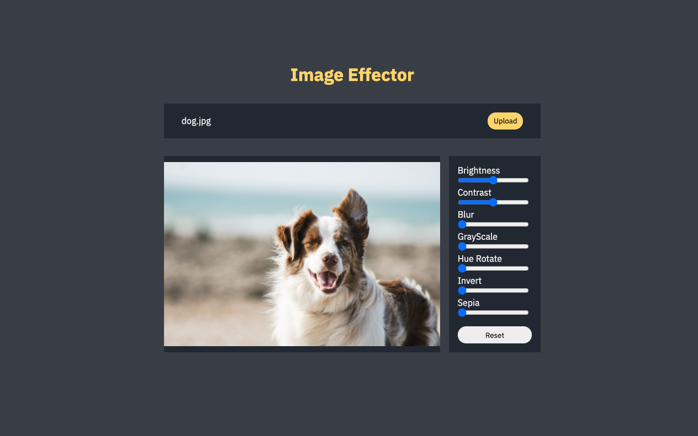

Vanilla (Pure) Javascript project for beginners.  
Check more projects [here](https://github.com/coachoox/vanilla-js-projects).

# Simple Image Effector

Simple image effector made with Vanilla Javascript.  
[[Demo]](https://coachoox.github.io/js-image-effector/)  

## Preview

## Features

-   Upload Image
-   Apply Filters
    -   Brightness
    -   Contrast
    -   Blur
    -   Gray Scale
    -   Hue Rotate
    -   Invert
    -   Sepia

## Copyrights & Reference

-   Font : [IBM Plex Sans](https://fonts.google.com/specimen/IBM+Plex+Sans?preview.text_type=custom)
-   Image : https://unsplash.com/photos/U3aF7hgUSrk
